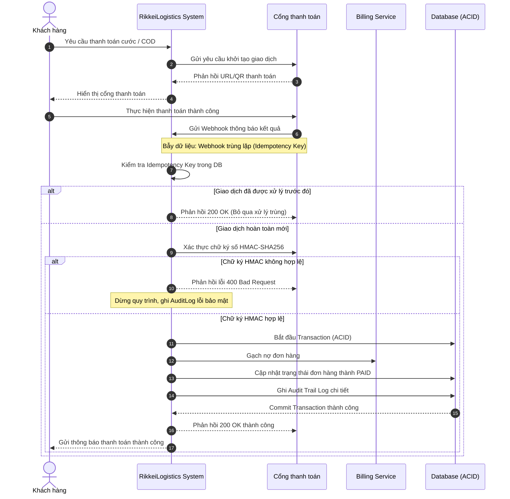

# BÁO CÁO PHÂN TÍCH TRADE-OFF GIẢI PHÁP TÍCH HỢP THANH TOÁN VÀ ĐỐI SOÁT COD

> 👤 **Học viên:** Đỗ Hoàng Sơn | **Mã SV:** PTIT-HCM-066
> 🏫 **Môn học:** IT105-K25-Phan-tich-thi-t-k-h-th-ng

---

## 📊 Sơ đồ thiết kế hệ thống (Sequence Diagram)

> 💡 *Sơ đồ dưới đây được render tự động trực tiếp trên GitHub bằng Mermaid. Bạn cũng có thể tải file **`bt4.drawio`** trong repository này để mở và chỉnh sửa trực tiếp trên [Draw.io (diagrams.net)](https://app.diagrams.net).* 

---

## Nhiệm vụ 1: Phân tích Trade-off và lựa chọn giải pháp

Trong bài toán tích hợp thanh toán và đối soát COD cho RikkeiLogistics với hơn 200.000 giao dịch mỗi ngày, việc lựa chọn kiến trúc đồng bộ hay bất đồng bộ đóng vai trò quyết định đến độ ổn định toàn hệ thống. Dưới đây là phân tích chi tiết hai giải pháp:

1. Giải pháp 1 (Sync API - Đồng bộ): Hệ thống gọi trực tiếp API của Cổng thanh toán và chờ kết quả trả về ngay lập tức trong luồng HTTP request.

2. Giải pháp 2 (Async Webhook / Queue - Bất đồng bộ): Hệ thống gọi khởi tạo giao dịch, sau đó Cổng thanh toán sẽ chủ động đẩy Webhook về hệ thống khi giao dịch hoàn tất kết hợp Message Queue để xếp hàng xử lý.

- Tiêu chí 1: Độ tin cậy khi nghẽn mạng. Sync API có độ rủi ro cao khi đường truyền timeout, dễ dẫn đến trạng thái lơ lửng (khách bị trừ tiền nhưng hệ thống chưa kịp ghi nhận). Async Webhook kết hợp Queue chịu tải cực tốt, tự động retry khi nghẽn mạng.
- Tiêu chí 2: Độ phức tạp triển khai. Sync API đơn giản, dễ viết code gọi và nhận response trực tiếp. Async Webhook phức tạp hơn do phải xây dựng cơ chế nhận webhook, xử lý hàng đợi Queue và chống trùng lặp.
- Tiêu chí 3: Rủi ro sai lệch dữ liệu tài chính. Sync API dễ gây lệch dữ liệu nếu mất kết nối giữa chừng. Async Webhook an toàn hơn nhờ cơ chế xác thực chữ ký HMAC và ghi nhận lịch sử giao dịch độc lập.

| Tiêu chí so sánh | Giải pháp 1 (Sync API) | Giải pháp 2 (Async Webhook/Queue) |
| --- | --- | --- |
| Độ tin cậy khi nghẽn mạng | Thấp (Dễ timeout, rủi ro mất kết nối giữa chừng) | Cao (Có cơ chế Queue retry và Webhook độc lập) |
| Độ phức tạp triển khai | Thấp (Dễ code, luồng tuần tự đơn giản) | Cao (Cần xử lý Webhook, Queue, Idempotency) |
| Rủi ro sai lệch dữ liệu | Cao (Khách trừ tiền nhưng hệ thống không gạch nợ) | Thấp (Đảm bảo ACID và Audit Trail Log đầy đủ) |

## Nhiệm vụ 2: Hoàn thiện Sơ đồ Tuần tự (Sequence Diagram)

Dựa trên sơ đồ tuần tự nháp của đề bài, quy trình chuẩn TO-BE đã được bổ sung đầy đủ 2 bước trọng yếu còn thiếu để đảm bảo an toàn tài chính:

1. Bước xác thực chữ ký HMAC: Trước khi Billing Service tiến hành gạch nợ đơn hàng, hệ thống bắt buộc phải kiểm tra mã chữ ký số HMAC-SHA256 do Cổng thanh toán gửi kèm trong Webhook nhằm chống giả mạo dữ liệu.

2. Bước cập nhật trạng thái đơn hàng: Sau khi gạch nợ thành công trong một transaction ACID khép kín, hệ thống tiến hành cập nhật trạng thái đơn hàng thành PAID và ghi nhận vào Audit Log.

- Xử lý bẫy dữ liệu Idempotency Key Conflict: Khi ngân hàng gửi trùng Webhook 2 lần cho cùng một giao dịch, hệ thống sẽ tra cứu bảng PaymentTransaction, nếu phát hiện Idempotency Key đã được xử lý thành công trước đó thì lập tức trả về HTTP 200 OK và bỏ qua các bước xử lý tiếp theo.
- Xử lý bẫy dữ liệu tài khoản nhận COD: Trường hợp tài khoản ví người gửi bị khóa hoặc sai thông tin, hệ toán tự động chuyển giao dịch sang trạng thái SETTLEMENT_FAILED và đẩy vào hàng đợi xử lý ngoại lệ cho bộ phận kế toán kiểm tra thủ công.

## Nhiệm vụ 3: Danh sách bảng dữ liệu và Cơ chế bảo mật

Để đảm bảo lưu trữ toàn vẹn dữ liệu tài chính và phục vụ đối soát tự động trong vòng 24h, hệ thống thiết kế 4 bảng dữ liệu cốt lõi:

1. Shipment: Lưu thông tin vận đơn, cước phí, trạng thái vận chuyển và liên kết với mã thanh toán.

2. PaymentTransaction: Lưu lịch sử giao dịch thanh toán (Mã giao dịch, số tiền, phương thức, Idempotency Key, trạng thái PAID/FAILED).

3. CODSettlement: Quản lý đối soát tiền COD thu hộ từ shipper, thời gian nộp tiền và thời điểm chuyển tiền vào ví người gửi.

4. AuditLog: Ghi lại toàn bộ dấu vết kiểm toán (Audit Trail) cho mọi thao tác tài chính nhằm phục vụ kiểm tra khi có tranh chấp.

Mô tả ngắn cơ chế bảo mật:

- API Key: Sử dụng định danh các đối tác tích hợp và Gateway, kèm theo giới hạn IP Whitelist.

- HMAC Checksum (HMAC-SHA256): Sử dụng khóa bí mật (Secret Key) để ký dữ liệu truyền tải qua Webhook, ngăn chặn tuyệt đối tình trạng kẻ gian giả mạo gói tin thanh toán.

---

## 📁 Danh sách tệp tin nộp bài trong Repository
- 📝 `bt4.docx`: Báo cáo tài liệu phân tích nghiệp vụ hoàn chỉnh.
- 🎨 `bt4.drawio`: File thiết kế sơ đồ chuẩn theo quy định đề bài (mở trực tiếp bằng [Draw.io](https://app.diagrams.net) hoặc Lucidchart).
